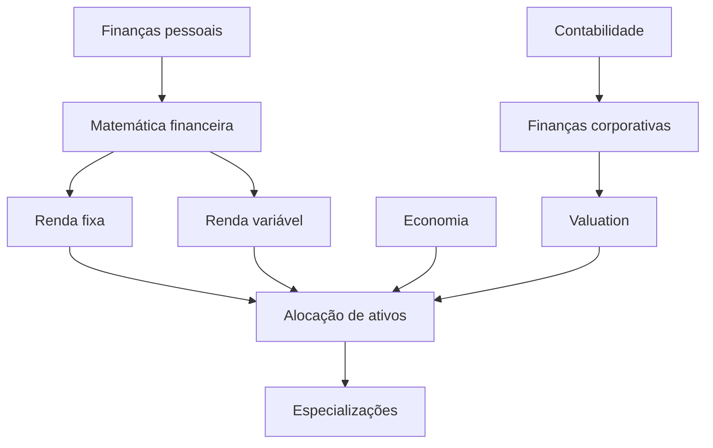

# Universidade Livre — Finanças, Investimentos e Economia (Brasil)

Um caminho **livre, aberto e estruturado** para a educação autodidata em **finanças**, **investimentos**, **economia**, **finanças corporativas** e **empreendedorismo**, inspirado no modelo da Universidade Livre.

> **Aviso importante:** este repositório tem fins exclusivamente educacionais. **Não é recomendação** de investimento, compra/venda de ativos ou aconselhamento financeiro, tributário ou jurídico.

---

## Como usar

* Siga as etapas em ordem (ou pule apenas se dominar os pré‑requisitos).
* Priorize **entendimento conceitual**, não atalhos de mercado.
* Ao final de cada etapa, realize **um projeto prático**.

Recomendação: mantenha um fork com um diretório `meu-progresso/` contendo resumos, planilhas e notebooks.

---

## Princípios do currículo

Este currículo privilegia conteúdos que:

* sejam **gratuitos ou parcialmente abertos** (quando pagos, claramente marcados);
* tenham **estrutura pedagógica** (curso, livro‑texto, trilha);
* venham de **instituições reconhecidas** ou autores referência;
* respeitem **direitos autorais** (linkar é ok; redistribuir, não).

---

## Dependências entre assuntos

---

## Currículo

### 0ª Etapa — Ferramentas e base

**Conteúdos**

* Excel / Google Sheets (fórmulas, tabelas dinâmicas)
* Estatística básica

**Recursos**

* Excel / Sheets: [https://support.microsoft.com/excel](https://support.microsoft.com/excel) • [https://support.google.com/docs](https://support.google.com/docs)
* Estatística: [https://pt.khanacademy.org/math/statistics-probability](https://pt.khanacademy.org/math/statistics-probability)

**Projetos sugeridos**

* Planilha de orçamento pessoal
* Análise simples de inflação ou taxa Selic

---

### 1ª Etapa — Finanças pessoais e cidadania financeira

**Recursos**

* Banco Central — [https://www.bcb.gov.br/cidadaniafinanceira/cursos](https://www.bcb.gov.br/cidadaniafinanceira/cursos)
* FGV — [https://portal.fgv.br/noticias/fgv-oferece-cursos-gratuitos-em-educacao-financeira](https://portal.fgv.br/noticias/fgv-oferece-cursos-gratuitos-em-educacao-financeira)
* CVM — [https://www.gov.br/investidor/pt-br/educacional](https://www.gov.br/investidor/pt-br/educacional)

**Projetos sugeridos**

* Planejamento financeiro pessoal completo
* Checklist de proteção contra fraudes e produtos inadequados

---

### 2ª Etapa — Investimentos (fundamentos)

**Recursos**

* FGV — Como Fazer Investimentos 1 e 2
  [https://educacao-executiva.fgv.br/cursos/online/curta-media-duracao-online/como-fazer-investimentos-1](https://educacao-executiva.fgv.br/cursos/online/curta-media-duracao-online/como-fazer-investimentos-1)
* B3 Educação — [https://edu.b3.com.br](https://edu.b3.com.br)
* ANBIMA Edu — [https://anbimaedu.com.br](https://anbimaedu.com.br)

**Projetos sugeridos**

* Carteira fictícia (renda fixa x renda variável)
* Simulação de rebalanceamento

---

### 3ª Etapa — Economia (micro e macro)

**Recursos**

* Microeconomia (Unicamp) — [https://www.youtube.com/playlist?list=PLHK-p1PtwCjwcSjwf1oKNoJGbsYy80ssT](https://www.youtube.com/playlist?list=PLHK-p1PtwCjwcSjwf1oKNoJGbsYy80ssT)
* Macroeconomia — [https://www.youtube.com/playlist?list=PL2WRcOQhp8QwOR-exB0FYO5b1Qbcbjd-K](https://www.youtube.com/playlist?list=PL2WRcOQhp8QwOR-exB0FYO5b1Qbcbjd-K)

**Projetos sugeridos**

* Painel macroeconômico brasileiro
* Estudo simples de elasticidade

---

### 4ª Etapa — Empreendedorismo e negócios

**Recursos**

* Sebrae — [https://sebrae.com.br/sites/PortalSebrae/cursosonline](https://sebrae.com.br/sites/PortalSebrae/cursosonline)
* BNDES — [https://www.bndes.gov.br/wps/portal/site/home/treina-bndes](https://www.bndes.gov.br/wps/portal/site/home/treina-bndes)
* FGV — Empreendedorismo para o Mercado Financeiro
* Link School of Business (pago) — [https://lsb.edu.br/pt-br](https://lsb.edu.br/pt-br)

**Projetos sugeridos**

* Modelo de negócios + fluxo de caixa
* Simulação de financiamento

---

### 5ª Etapa — Finanças Corporativas e Valuation

**Recursos**

* MIT OpenCourseWare — Corporate Finance
  [https://ocw.mit.edu](https://ocw.mit.edu)
* Aswath Damodaran — Valuation
  [http://pages.stern.nyu.edu/~adamodar/](http://pages.stern.nyu.edu/~adamodar/)

**Projetos sugeridos**

* Valuation simples por fluxo de caixa descontado
* Análise financeira de empresa listada

---

## Especializações (conteúdo para `specializations/`)

### 📈 Investimentos

* Renda fixa, renda variável, fundos, ETFs, derivativos
* Gestão de carteira e risco

### 🌍 Economia

* Microeconomia
* Macroeconomia
* Economia brasileira

### 🚀 Empreendedorismo

* Finanças para startups
* Precificação
* Crescimento e sustentabilidade

### 💼 Carreira no Mercado Financeiro (Brasil)

* Ética e regulação
* Estrutura do SFN

### 🧾 Certificações (CPA‑10, CPA‑20, CEA)

* Trilhas da ANBIMA Edu
* Planejamento de estudos e simulados

---

## Extras (`extras/`)

* Webinars da B3 — [https://edu.b3.com.br/eventos](https://edu.b3.com.br/eventos)
* Webinars e aulas abertas da FGV
* Oficinas do Sebrae
* Leituras clássicas e masterclasses internacionais

---

## Como contribuir

Veja [CONTRIBUTING.md](CONTRIBUTING.md).
