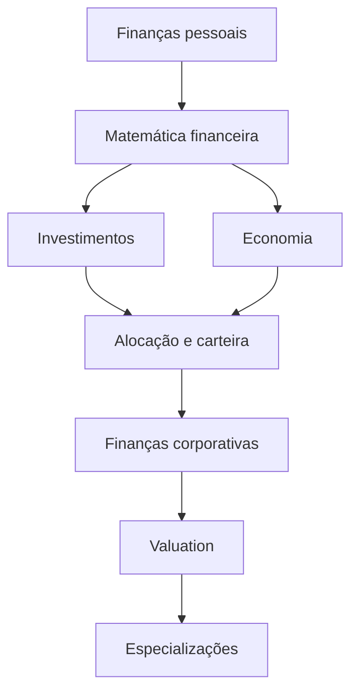

# Universidade Livre — Finanças, Investimentos e Economia (Brasil)

Um **currículo aberto e autodidata** para estudar **finanças, investimentos, economia, finanças corporativas e empreendedorismo**, com foco em fundamentos e prática — inspirado no modelo da Universidade Livre.

> ⚠️ Este repositório tem fins **exclusivamente educacionais**.  
> Não é recomendação de investimento nem substitui aconselhamento profissional.

---

## 📑 Sumário

- [Para quem é este currículo?](#-para-quem-é-este-currículo)
- [Como usar este repositório](#-como-usar-este-repositório)
- [Princípios do currículo](#-princípios-do-currículo)
- [Mapa do currículo](#️-mapa-do-currículo)
- [Currículo (visão geral)](#-currículo-visão-geral)
  - [0ª Etapa — Ferramentas e base](#0ª-etapa--ferramentas-e-base)
  - [1ª Etapa — Finanças pessoais](#1ª-etapa--finanças-pessoais-e-cidadania-financeira)
  - [2ª Etapa — Investimentos](#2ª-etapa--investimentos-fundamentos)
  - [3ª Etapa — Economia](#3ª-etapa--economia-micro-e-macro)
  - [4ª Etapa — Empreendedorismo](#4ª-etapa--empreendedorismo-e-negócios)
  - [5ª Etapa — Finanças corporativas](#5ª-etapa--finanças-corporativas-e-valuation)
- [Projetos práticos](#️-projetos-práticos)
- [Especializações](#-especializações)
- [Extras](#-extras)
- [Como contribuir](#-como-contribuir)
- [Licença](#-licença)

---

## 🎯 Para quem é este currículo?

- Pessoas começando do zero em finanças
- Quem quer **entender fundamentos**, não “dicas de mercado”
- Estudantes autodidatas
- Profissionais migrando para o mercado financeiro
- Empreendedores que querem dominar números

---

## 🧭 Como usar este repositório

1. Siga as **etapas do currículo** na ordem sugerida  
2. Ao final de cada etapa, faça **um projeto prático**
3. Use as **especializações** para aprofundar
4. Registre seu progresso em um fork

📁 Sugestão de estrutura pessoal:

```text
meu-progresso/
├─ resumos/
├─ planilhas/
└─ projetos/
````

---

## 🧠 Princípios do currículo

* Fundamentos antes de produtos
* Teoria + prática
* Fontes confiáveis
* Conteúdo aberto sempre que possível
* Aprender fazendo

---

## 🗺️ Mapa do currículo



---

## 📚 Currículo (visão geral)

> 📌 **Os detalhes completos de cada etapa estão descritos no próprio README desta seção e nas pastas do repositório.**

---

### 0ª Etapa — Ferramentas e base

**Cursos e recursos**

* Excel / Google Sheets
  [https://support.microsoft.com/excel](https://support.microsoft.com/excel)
  [https://support.google.com/docs](https://support.google.com/docs)
* Estatística básica (Khan Academy)
  [https://pt.khanacademy.org/math/statistics-probability](https://pt.khanacademy.org/math/statistics-probability)

---

### 1ª Etapa — Finanças pessoais e cidadania financeira

**Cursos**

* Banco Central — Cidadania Financeira
  [https://www.bcb.gov.br/cidadaniafinanceira/cursos](https://www.bcb.gov.br/cidadaniafinanceira/cursos)
* FGV — Educação Financeira
  [https://portal.fgv.br/noticias/fgv-oferece-cursos-gratuitos-em-educacao-financeira](https://portal.fgv.br/noticias/fgv-oferece-cursos-gratuitos-em-educacao-financeira)
* CVM — Portal do Investidor
  [https://www.gov.br/investidor/pt-br/educacional](https://www.gov.br/investidor/pt-br/educacional)

---

### 2ª Etapa — Investimentos (fundamentos)

**Cursos**

* FGV — Como Fazer Investimentos 1 e 2
  [https://educacao-executiva.fgv.br/cursos/online/curta-media-duracao-online/como-fazer-investimentos-1](https://educacao-executiva.fgv.br/cursos/online/curta-media-duracao-online/como-fazer-investimentos-1)
* B3 Educação
  [https://edu.b3.com.br](https://edu.b3.com.br)
* ANBIMA Edu
  [https://anbimaedu.com.br](https://anbimaedu.com.br)

---

### 3ª Etapa — Economia (micro e macro)

**Cursos**

* Microeconomia (Unicamp – aulas abertas)
  [https://www.youtube.com/playlist?list=PLHK-p1PtwCjwcSjwf1oKNoJGbsYy80ssT](https://www.youtube.com/playlist?list=PLHK-p1PtwCjwcSjwf1oKNoJGbsYy80ssT)
* Macroeconomia (playlist aberta)
  [https://www.youtube.com/playlist?list=PL2WRcOQhp8QwOR-exB0FYO5b1Qbcbjd-K](https://www.youtube.com/playlist?list=PL2WRcOQhp8QwOR-exB0FYO5b1Qbcbjd-K)

---

### 4ª Etapa — Empreendedorismo e negócios

**Cursos**

* Sebrae — Cursos Online
  [https://sebrae.com.br/sites/PortalSebrae/cursosonline](https://sebrae.com.br/sites/PortalSebrae/cursosonline)
* BNDES — Trein@ BNDES
  [https://www.bndes.gov.br/wps/portal/site/home/treina-bndes](https://www.bndes.gov.br/wps/portal/site/home/treina-bndes)
* FGV — Empreendedorismo para o Mercado Financeiro
  [https://educacao-executiva.fgv.br](https://educacao-executiva.fgv.br)
* Link School of Business (pago)
  [https://lsb.edu.br/pt-br](https://lsb.edu.br/pt-br)

---

### 5ª Etapa — Finanças corporativas e valuation

**Cursos**

* MIT OpenCourseWare — Corporate Finance
  [https://ocw.mit.edu](https://ocw.mit.edu)
* Aswath Damodaran — Valuation
  [http://pages.stern.nyu.edu/~adamodar/](http://pages.stern.nyu.edu/~adamodar/)

---

## 🛠️ Projetos práticos

📄 Lista completa em [`PROJECTS.md`](PROJECTS.md)

---

## 🎓 Especializações

📁 Pasta: [`specializations/`](specializations/)

* 📈 [Investimentos](specializations/investimentos)
* 🌍 [Economia](specializations/economia)
* 🚀 [Empreendedorismo](specializations/empreendedorismo)
* 💼 [Carreira no Mercado Financeiro](specializations/carreira-mercado-financeiro)
* 🧾 [Certificações (CPA-10, CPA-20, CEA)](specializations/certificacoes)
* 🏢 [Finanças Corporativas e Valuation](specializations/financas-corporativas)

---

## 📦 Extras

📁 Pasta: [`extras/`](extras/)

---

## 🤝 Como contribuir

Veja [`CONTRIBUTING.md`](CONTRIBUTING.md).

---

## 📜 Licença

MIT License.


