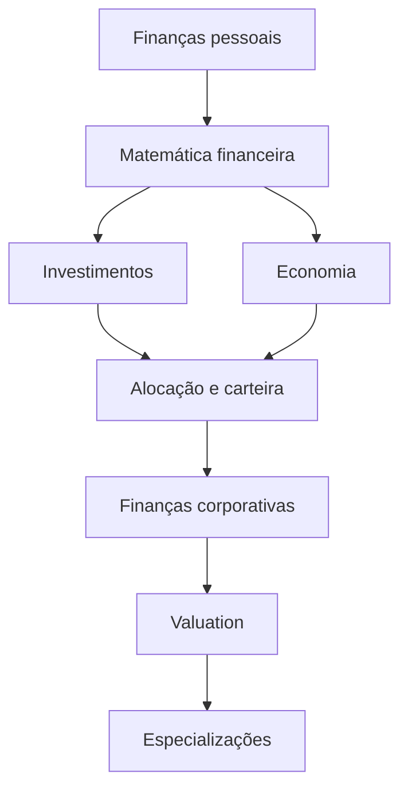

# Universidade Livre — Finanças, Investimentos e Economia (Brasil)

Um **currículo aberto e autodidata** para estudar **finanças, investimentos, economia, finanças corporativas e empreendedorismo**, com foco em fundamentos e prática — inspirado no modelo da Universidade Livre.

> ⚠️ **Aviso:** Este repositório tem fins **exclusivamente educacionais**.  
> Não é recomendação de investimento nem substitui aconselhamento profissional.

---

## 🎯 Para quem é este currículo?

* Pessoas começando do zero em finanças.
* Quem quer **entender fundamentos**, não apenas “dicas de mercado”.
* Estudantes autodidatas.
* Profissionais migrando para o mercado financeiro.
* Empreendedores que querem dominar números.

---

## 🧭 Como usar este repositório

1.  Siga as **etapas do currículo** na ordem sugerida.
2.  Ao final de cada etapa, faça **um projeto prático**.
3.  Use as **especializações** para aprofundar.
4.  Registre seu progresso em um *fork*.

**📁 Sugestão de estrutura de pastas para seus estudos:**

```text
meu-progresso/
├─ resumos/
├─ planilhas/
└─ projetos/
```

---

## 🧠 Princípios do currículo

* Fundamentos antes de produtos.
* Teoria + prática.
* Fontes confiáveis.
* Conteúdo aberto sempre que possível.
* Aprender fazendo.

---

## 🗺️ Mapa do currículo



---

## 📚 Currículo (Visão Geral)

*Detalhes, links de estudo e referências bibliográficas estão descritos dentro da pasta de cada etapa.*

### 0️⃣ Ferramentas e base

* Excel / Google Sheets
* Estatística básica

### 1️⃣ Finanças pessoais e cidadania financeira

* Planejamento financeiro
* Proteção do investidor

### 2️⃣ Investimentos (fundamentos)

* Renda fixa e variável
* Diversificação
* Mercado financeiro brasileiro

### 3️⃣ Economia (micro e macro)

* Microeconomia
* Macroeconomia
* Economia brasileira

### 4️⃣ Empreendedorismo e negócios

* Modelos de negócio
* Fluxo de caixa
* Financiamento

### 5️⃣ Finanças corporativas e valuation

* Análise de balanços
* Custo de capital
* Valuation (DCF)

---

## 🛠️ Projetos práticos

Os projetos são parte central do aprendizado.

👉 *Veja a lista completa e instruções em `PROJECTS.md`.*

**Exemplos:**

* Orçamento pessoal detalhado.
* Montagem de carteira de investimentos fictícia.
* Criação de um painel (dashboard) macroeconômico.
* Valuation completo de uma empresa listada na B3.
* Plano financeiro de um novo negócio.

---

## 🎓 Especializações

As trilhas de aprofundamento encontram-se no diretório `specializations/`:

* 📈 **Investimentos** (Aprofundado)
* 🌍 **Economia**
* 🚀 **Empreendedorismo**
* 💼 **Carreira no Mercado Financeiro** (Brasil)
* 🧾 **Certificações** (CPA-10, CPA-20, CEA)
* 🏢 **Finanças Corporativas e Valuation**

---

## 📦 Extras

Conteúdos complementares, lista de eventos, recomendações de livros e masterclasses estão no diretório `extras/`.

---

## 🤝 Como contribuir

Quer sugerir um conteúdo ou corrigir um erro? Veja o guia em `CONTRIBUTING.md`.

---

## 📜 Licença

Distribuído sob a licença **MIT License**.


